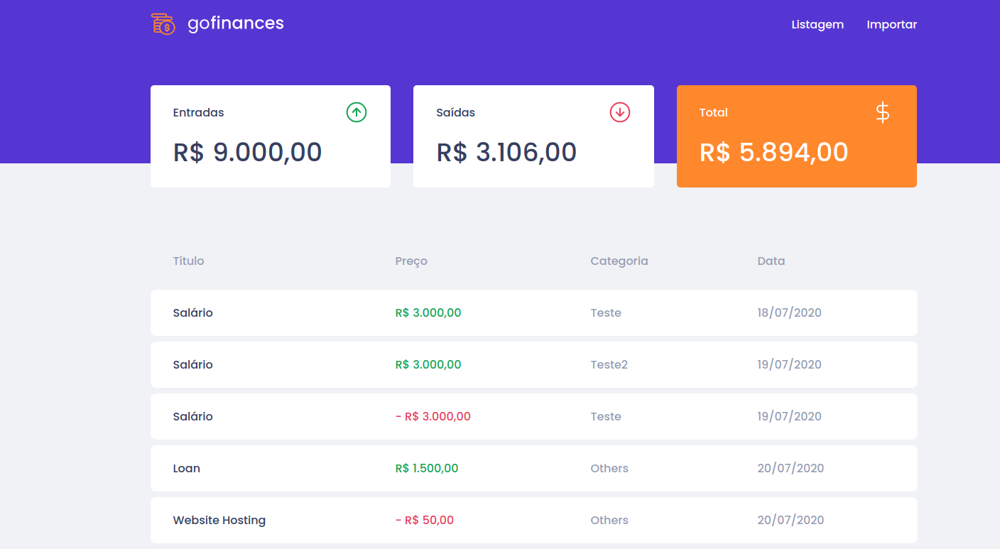
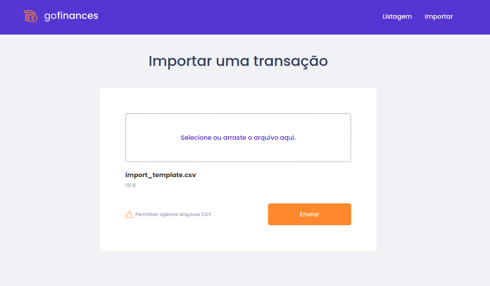

<h3 align="center">
  Desafio 07: GoFinances Web
</h3>

## :rocket: Sobre o desafio

Nesse desafio, usando TypeScript foi aplicado os conceitos do ReactJS para a criação da aplicação de gestão de transações, a GoFinances, utilizando rotas e envio de arquivos por formulário.

Essa será uma aplicação que irá se conectar ao backend do [Desafio 06](https://github.com/johnnycruz-dev/New-GoStack-Desafio06), e exibir as transações criadas e permitir a importação de um arquivo CSV para gerar novos registros no banco de dados.

Telas da aplicação:

    
    

